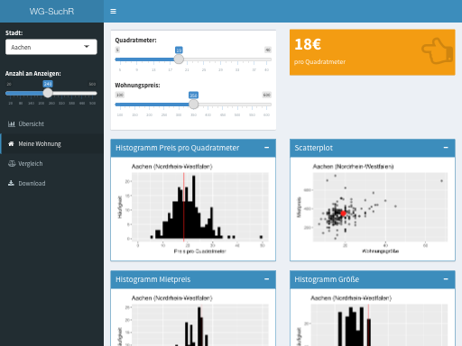
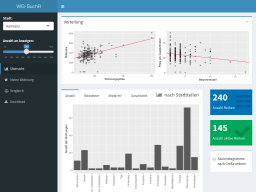
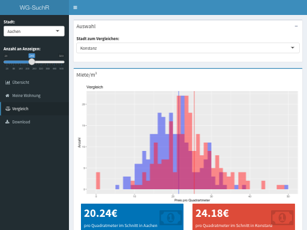

WG-SuchR
================

## Beschreibung

WG-SuchR ist eine App die mit R und Shiny erstellt wurde. Sie ermöglicht
es Daten zu WG-Anzeigen von der Webseite
[wg-gesucht.de](http://www.wg-gesucht.de) zu beziehen und diese direkt
auszuwerten. Die Auswertung und Datensammlung erfolgt immer für eine
Stadt, welche am Anfang zusammen mit der Stichprobengröße ausgewählt
wird. Die App gliedert sich in 4 Kategorien: Übersicht, Meine Wohnung,
Vergleich und Download.

### Übersicht 🔭



Die Kategorie “Übersicht” ermöglicht mittels Scatterplotts einen
Überblick über die Verteilung der Daten und durch Regressionsgeraden
darin eine Rückschluss auf eventuelle Effekte. Des Weiteren lassen sich
mehrere Säulendiagramma generieren, die Informationen nach Stadtteilen
gegliedert anzeigen. Diese können nach Größe geordnet oder ungeordnet
angezeigt werden. Außerdem wird in zwei Kreisdiagrammen das
durchschnittliche Geschlechterverhältnis innerhalb der WGs und an
gesuchten Mitbewohnern gezeigt.

### Meine Wohnung 🏡



Im Abschnitt “Meine Wohnung” kann man Kennwerte zur eigenen Wohnung
angeben und auf deren Basis die eigene Wohnung in Bezug zur Verteilung
der WGs innerhalb der Stadt setzen lassen. Außerdem wird mit Hilfe der
Standardabweichung der eigene Quadratmeterpreis als unter-, über- oder
durchschnittlich eingestuft.

### Vergleich 📈



In diesem Abschnitt lässt sich die ausgewählte Stadt mit einer weiteren
Stadt in Bezug auf die Verteilung des Preises pro m² vergleichen und es
werden die jeweiligen Durchschnittspreise angezeigt.

### Download 📋

Hier kann man den aktuellen Datensatz anschauen und herunterladen.

## Start der Shiny App 🚀

Um die Shiny App zu starten, bitte zuerst dieses repository klonen und
dann in R als working directory setzen (wenn man den Ordner in RStudio
öffnet geschieht das automatisch). Danach einfach die benötigten
Packages aus der `DESCRIPTION` laden (das sind
`shiny, shinydashboard, rvest, jsonlite, tidyverse, ggplot2`) und über
`runApp('inst/app')` die App starten.

``` r
# Load libraries
library(tidyverse)
library(shiny)
library(shinydashboard)
library(rvest)
library(jsonlite)
library(tidyverse)
library(ggplot2)

# Run the shiny app
runApp('inst/app')
```
